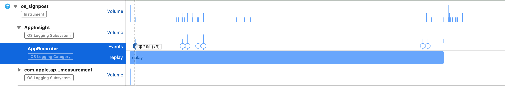

# os_signpost


[TOC]

开发过程中，我们会借助 log 去分析一些问题，log 是非常有效的，但是不是很直观，借助 signpost 我们可以让 log 更加直观，对于解决问题更有帮助。

## 使用

### os_log_create(subsystem, category)


```
// 模块 分类
os_log_create(subsystem, category)
```

可以创建多个 subsystem, 每个 subsystem 下面可以创建多个 category。


### os_signpost_id_generate


### os_signpost_interval_begin 

  log、interval_id 和 name 用来标志事件，对事件进行分组

  ```
  // os_signpost_interval_begin(log, interval_id, name, ...)
  
  if (@available(iOS 12.0, *)) {
      os_signpost_interval_begin(self.osLogT, self.osSignpostIdT, "replay");
  }
  ```

  

### os_signpost_interval_end  

  log、interval_id 和 name 用来标志事件，对事件进行分组，end 中的参数必须和begin 中的参数完全一致才能结束之前 begin 的事件

  ```
  // os_signpost_interval_end(log, interval_id, name, ...)
  if (@available(iOS 12.0, *)) {
      os_signpost_interval_end(appRecorder.osLogT, appRecorder.osSignpostIdT, "replay");
  }
  ```

  

### os_signpost_event_emit 

在begin 和 end 之间，我们可以额外添加一些事件，可以进一步记录当时的现场。

  ```
  // os_signpost_event_emit(log, event_id, name, ...) 
  
  AppRecorder *appRecorder = [AppInsight sharedInstance].appRecorder;
  
  if (@available(iOS 12.0, *)) {
  		os_signpost_event_emit(appRecorder.osLogT,appRecorder.osSignpostIdT, "add frame","第%ld帧",frameIndex);		
  }
  ```


借助 os_signpost 记录的视频录制的过程，可以看到第2帧有个(x3),也就是非常短的时间有三帧数据(0/1/2三帧)。这是没有必要的，只需要一帧即可。




另外一个问题，我们可以看到最后一帧到录制结束间隔时间非常长，这可能是不正常的。


如果不需要传入动态参数

```
os_signpost_event_emit(self.osLogT,self.osSignpostIdT, "replay","pause");
```


## 封装


```
//
//  NSObject+SignPost.h
//  AppInsight
//
//  Created by MAC on 2021/4/21.
//  Copyright © 2021 AppInsight. All rights reserved.
//

#import <Foundation/Foundation.h>
#import <os/signpost.h>

NS_ASSUME_NONNULL_BEGIN

@interface NSObject (SignPost)

@property (nonatomic, strong) os_log_t osLogT;
@property (nonatomic, assign) os_signpost_id_t osSignpostIdT;

/// 使 id +1
- (os_signpost_id_t)generateId;

@end

NS_ASSUME_NONNULL_END


//
//  NSObject+SignPost.m
//  AppInsight
//
//  Created by MAC on 2021/4/21.
//  Copyright © 2021 AppInsight. All rights reserved.
//

#import "NSObject+SignPost.h"
#import <objc/runtime.h>

@implementation NSObject (SignPost)

- (void)setOsLogT:(os_log_t)osLogT {
    objc_setAssociatedObject(self, @"osLogT", osLogT, OBJC_ASSOCIATION_RETAIN_NONATOMIC);
}

- (os_log_t)osLogT {
    os_log_t log = objc_getAssociatedObject(self, @"osLogT");
    if (log == nil) {
        log = os_log_create("AppInsight", [NSStringFromClass(self.class) UTF8String]);
        objc_setAssociatedObject(self, @"osLogT", log, OBJC_ASSOCIATION_RETAIN_NONATOMIC);
    }
    return log;
}

- (void)setOsSignpostIdT:(os_signpost_id_t)osSignpostIdT {
    objc_setAssociatedObject(self, @"osSignpostIdT", @(osSignpostIdT), OBJC_ASSOCIATION_ASSIGN);
}

- (os_signpost_id_t)osSignpostIdT {
    if (@available(iOS 12.0, *)) {
        os_signpost_id_t sign = [objc_getAssociatedObject(self, @"osSignpostIdT") longLongValue];
        if (sign == 0) {
            // 每次调用该方法生成的id会递增
            sign = os_signpost_id_generate(self.osLogT);
            objc_setAssociatedObject(self, @"osSignpostIdT", @(sign), OBJC_ASSOCIATION_ASSIGN);
        }
        return sign;
    } else {
        // Fallback on earlier versions
    }
    return 0;
}

- (os_signpost_id_t)generateId {
    if (@available(iOS 12.0, *)) {
        os_signpost_id_t sign = os_signpost_id_generate(self.osLogT);
        [self setOsSignpostIdT:sign];
    } else {
        // Fallback on earlier versions
    }
    return self.osSignpostIdT;
}

@end

```

