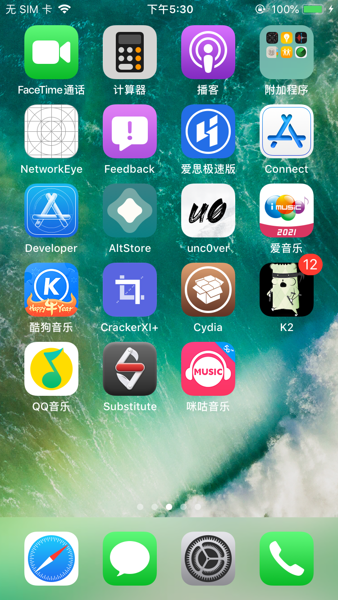
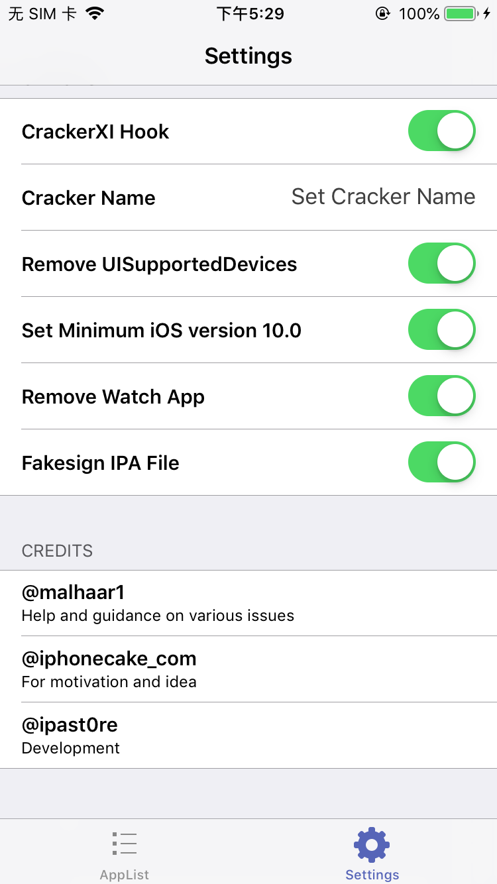
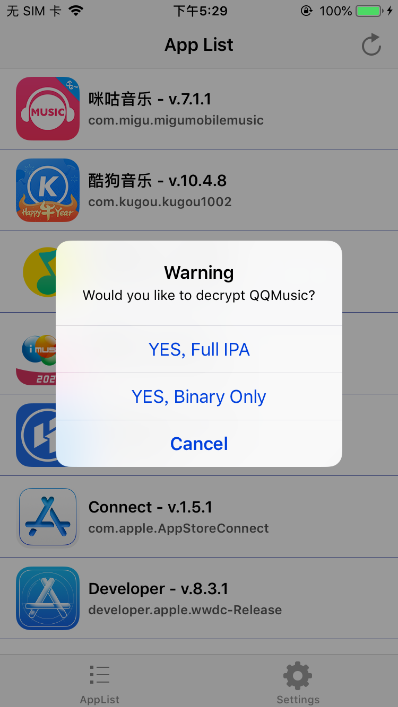
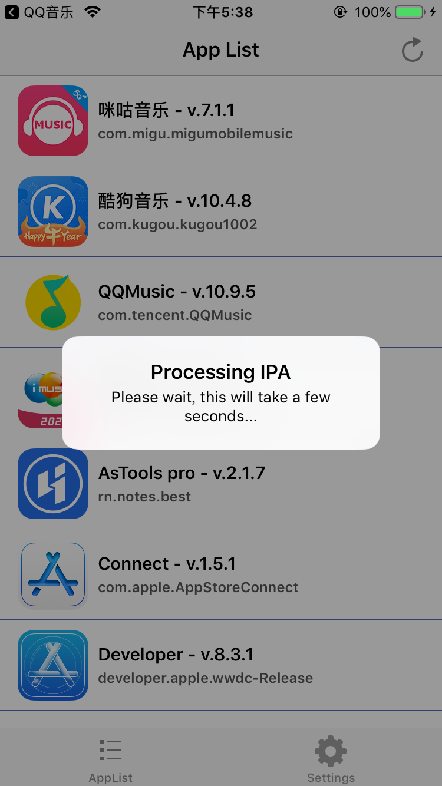
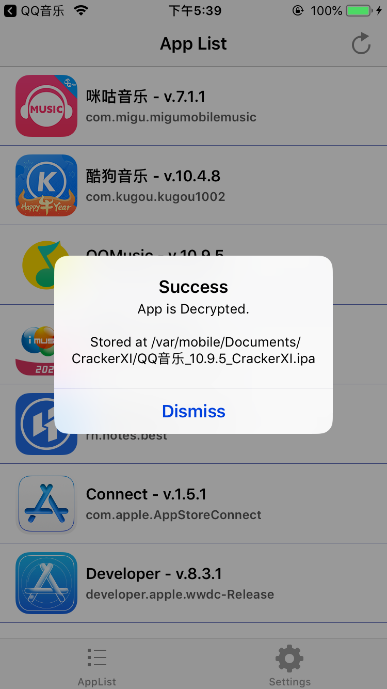
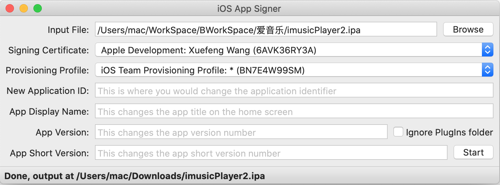
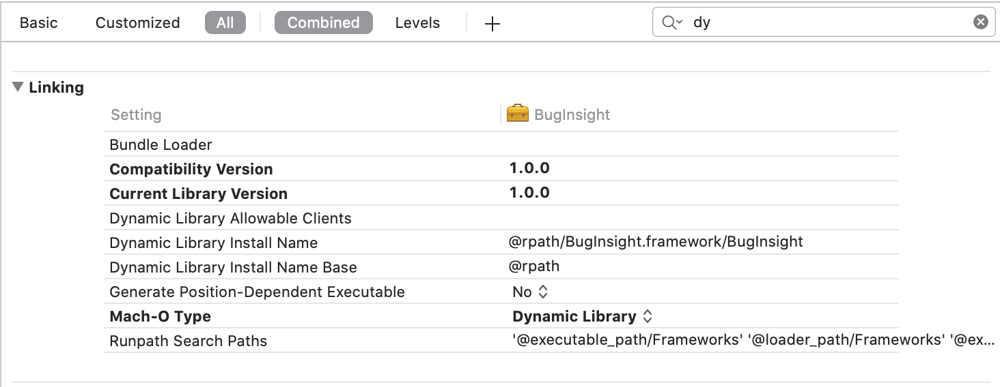

# 越狱相关

[TOC]

## 越狱

* 手机：iPhone 6s 

* 系统版本：iOS 版本 12.4

### 爱思助手

使用爱思助手一键越狱，老是在生成安装包这一步失败。

### unc0ver

使用 [unc0ver](https://unc0ver.dev) 进行越狱是可以的。

 下载下来是一个ipa，对这个ipa用自己的证书进行签名，然后装到要越狱的机器上就可以。

安装上去点击 越狱即可，广告不用管，多点几次最后就成功了。

越狱之后，Cydia 可能在重启设备后打开就闪退，目前，我是在unc0ver重新点击 Jailbreak ，没什么数据丢失。


## SSH

*SSH* 是较可靠，专为远程登录会话和其他网络服务提供安全性的协议。

### iPhone 开启 SSH

通过 cydia 安装 OpenSSH，这样可以远程登录到到手机上，用电脑控制手机。

### Mac 开启SSH

Mac 开启SSH，那手机端可以远程传输数据给Mac。

Mac本身安装了ssh服务，但是默认情况下不会开机自启，因此当我们需要用到ssh相关的功能时，只需以下一条命令即可。

1. 启动服务

   ```
   sudo launchctl load -w /System/Library/LaunchDaemons/ssh.plist
   ```

2. 查看是否启动

   ```
   sudo launchctl list | grep ssh
   
   # 如果看到下面的输出表示成功启动了
   - 0 com.openssh.sshd
   ```

3. 停止sshd服务

   ```
   sudo launchctl unload -w /System/Library/LaunchDaemons/ssh.plist
   ```

也可以在"系统偏好设置" -> "共享" -> "远程登录"进行操作。


默认密码是 `alpine`

```
ssh root@192.168.1.110
The authenticity of host '192.168.1.110 (192.168.1.110)' can't be established.
RSA key fingerprint is SHA256:bpTkEg1C5UPo1dGalw5MdzTJTOszthMb6lY+ZRSrra4.
Are you sure you want to continue connecting (yes/no/[fingerprint])? yes
Warning: Permanently added '192.168.1.110' (RSA) to the list of known hosts.
root@192.168.1.110's password: 
```


## 脱壳

### dumpdecrypted

1. 下载[dumpdecrypted](https://links.jianshu.com/go?to=https%3A%2F%2Fgithub.com%2Fstefanesser%2Fdumpdecrypted)，并通过`make`命令编译生成`dylib`库。

2. 将动态库拷贝越狱设备的指定目录

   ```
   scp dumpdecrypted.dylib root@192.168.1.106:/usr/lib
   ```

3. 将动态库注入到指定进程中

   * 查看进程

     ```
     yangteki-iPhone:~ root# ps -A | grep Application
       966 ??         0:18.77 /Applications/Cydia.app/Cydia
      1335 ??         0:00.09 /private/var/containers/Bundle/Application/A08EEDC4-C762-4F73-BAB9-F84D32795472/MobileMail.app/PlugIns/MailCacheDeleteExtension.appex/MailCacheDeleteExtension
      1336 ??         0:01.55 /var/containers/Bundle/Application/A08EEDC4-C762-4F73-BAB9-F84D32795472/MobileMail.app/MobileMail
      1536 ??         0:10.05 /var/containers/Bundle/Application/045A86A2-0171-4B82-9B5B-6819B0D8610C/imusicPlayer2.app/imusicPlayer2
      1587 ??         0:00.25 /private/var/containers/Bundle/Application/AB5FC6ED-E810-42D5-B4B1-D14D8B151EAA/Maps.app/PlugIns/MapsWidget.appex/MapsWidget
      1590 ??         0:01.45 /private/var/containers/Bundle/Application/65505231-E545-40FC-95BD-1E960B6C692D/Weather.app/PlugIns/WeatherAppTodayWidget.appex/WeatherAppTodayWidget
      1593 ??         0:01.64 /var/containers/Bundle/Application/1D071931-A793-4517-8517-DE65F06B5362/AltStore.app/AltStore
      1632 ??         0:05.10 /Applications/Preferences.app/Preferences
      1648 ttys001    0:00.01 grep Application
     ```
   
   * 注入
   
     ```
     cd /usr/lib
     DYLD_INSERT_LIBRARIES=dumpdecrypted.dylib /var/containers/Bundle/Application/045A86A2-0171-4B82-9B5B-6819B0D8610C/imusicPlayer2.app/imusicPlayer2
     ```
   
     这一步会报错，执行 `su mobile` 也没用，`cycript -p 进程id` 也不行，都是 `killed -9`

### Clutch

失败

```
Clutch -d cn.118100.imusicPlayer2
Zipping imusicPlayer2.app
Error: Could not obtain mach port, either the process is dead (codesign error?) or entitlements were not properly signed!

Error: Failed to dump <NotificationService> with arch arm64

2021-02-22 17:17:55.881 Clutch[5354:102640] failed operation :(
2021-02-22 17:17:55.881 Clutch[5354:102640] application <NSOperationQueue: 0x1043480a0>{name = 'NSOperationQueue 0x1043480a0'}
Error: Failed to dump <NotificationService>

2021-02-22 17:17:55.882 Clutch[5354:102640] failed operation :(
2021-02-22 17:17:55.882 Clutch[5354:102640] application <NSOperationQueue: 0x1043480a0>{name = 'NSOperationQueue 0x1043480a0'}
Error: Can't execute task_for_pid! Do you have the right permissions/entitlements?

Failed to find address of header!
Error: Failed to dump <imusicPlayer2> with arch arm64

2021-02-22 17:17:55.953 Clutch[5354:102638] failed operation :(
2021-02-22 17:17:55.953 Clutch[5354:102638] application <NSOperationQueue: 0x104336310>{name = 'NSOperationQueue 0x104336310'}
Error: Failed to dump <imusicPlayer2>

2021-02-22 17:17:55.953 Clutch[5354:102638] failed operation :(
2021-02-22 17:17:55.953 Clutch[5354:102638] application <NSOperationQueue: 0x104336310>{name = 'NSOperationQueue 0x104336310'}
Error: posix_spawn: Operation not permitted (Error 1)

Error: Failed to dump <NvStreamingSdkCore> with arch arm64

2021-02-22 17:17:55.973 Clutch[5354:102636] failed operation :(
2021-02-22 17:17:55.973 Clutch[5354:102636] application <NSOperationQueue: 0x104344d00>{name = 'NSOperationQueue 0x104344d00'}
Error: Failed to dump <NvStreamingSdkCore>

2021-02-22 17:17:55.974 Clutch[5354:102636] failed operation :(
2021-02-22 17:17:55.974 Clutch[5354:102636] application <NSOperationQueue: 0x104344d00>{name = 'NSOperationQueue 0x104344d00'}
Error: posix_spawn: Operation not permitted (Error 1)

Error: Failed to dump <SXVideoEnging> with arch arm64

2021-02-22 17:17:55.986 Clutch[5354:102639] failed operation :(
2021-02-22 17:17:55.986 Clutch[5354:102639] application <NSOperationQueue: 0x104359a50>{name = 'NSOperationQueue 0x104359a50'}
Error: Failed to dump <SXVideoEnging>

2021-02-22 17:17:55.986 Clutch[5354:102639] failed operation :(
2021-02-22 17:17:55.986 Clutch[5354:102639] application <NSOperationQueue: 0x104359a50>{name = 'NSOperationQueue 0x104359a50'}
Zipping NvStreamingSdkCore.framework
Zipping SXVideoEnging.framework
Zipping NotificationService.appex
FAILED: <imusicPlayer2 bundleID: cn.118100.imusicPlayer2>
Finished dumping cn.118100.imusicPlayer2 in 5.3 seconds
```


###  CrackerXI+

1. 在cydia中添加 repo.hackyouriphone.org
   源地址 [http://cydia.iphonecake.com](https://links.jianshu.com/go?to=http%3A%2F%2Fcydia.iphonecake.com)
   添加成功后，在cydia中搜索CrackerXI+并安装。
2. 安装成功后手机上多了一个App CrackerXI+，打开在Setting 里面全部勾上





​	选择 'YES, Full IPA'

3. 导出

   




成功之后通过 SSH 或者 iFunbox 传给 Ma c电脑进行重签名安装运行。


## Framework 注入 

* 目标ipa：imusicPlayer.ipa 

* 待注入Framework: BugInsight.framework

   BugInsight.framework 是动态库

  ```
  lipo -info /Users/mac/WorkSpace/BWorkSpace/爱音乐/BugInsight.framework/BugInsight
  Non-fat file: /Users/mac/WorkSpace/BWorkSpace/爱音乐/BugInsight.framework/BugInsight is architecture: arm64
  
  file /Users/mac/WorkSpace/BWorkSpace/爱音乐/BugInsight.framework/BugInsight
  /Users/mac/WorkSpace/BWorkSpace/爱音乐/BugInsight.framework/BugInsight: Mach-O 64-bit dynamically linked shared library arm64
  ```


使用 [yololib](https://github.com/KJCracks/yololib) 将 Framework 注入

1. 安装  [yololib](https://github.com/KJCracks/yololib) 

    yololib 是一个 Xcode  创建的 cmd 项目，下载后运行一下，main 函数报错，但是没有关系，因为我们只是要这个 cmd 项目的 Products。将 Products 下面的 yololib 复制到 `/usr/local/bin`,这样可以直接在命令行直接使用 `yololib` 命令。

   

2. 注入Framework

   1. 首先将ipa后者改成 zip,解压得到 Payload 文件夹

   2. 将要注入的 Framework 复制到 Payload/imusicPlayer2.app/Frameworks 里面，Frameworks 如果不存在，应该直接创建就可以。

   3. 修改 Mach-O

      ```
      
      ```

   


## 重签名

1. 重签名ipa

   直接使用 iOS App Signer 进行重签名就可以了，需要注意的是，你需要保证描述文件和证书是匹配的。



​		选中 Provisioning Profile ，空格可以查看 Provisioning Profile 对应的证书。


```
ideviceinstaller -i ~/Downloads/imusicPlayer2.ipa
```


## 运行注入SDK后的ipa


运行ipa 可能会遇到各种各样的问题

> crash log 1

```
Exception Type:  EXC_CRASH (SIGABRT)
Exception Codes: 0x0000000000000000, 0x0000000000000000
Exception Note:  EXC_CORPSE_NOTIFY
Termination Description: DYLD, Library not loaded: @executable_path/Frameworks/BugInsight.framework/BugInsight | Referenced from: /var/containers/Bundle/Application/815B83B9-AD75-4ADA-9B1D-BB9693902143/imusicPlayer2.app/imusicPlayer2 | Reason: no suitable image found.  Did find: | /var/containers/Bundle/Application/815B83B9-AD75-4ADA-9B1D-BB9693902143/imusicPlayer2.app/Frameworks/BugInsight.framework/BugInsight: no matching architecture in universal wrapper | /private/var/containers/Bundle/Application/815B83B9-AD75-4ADA-9B1D-BB9693902143/imusicPlayer2.app/Frameworks/BugInsight.framework/BugInsight: no matching architecture in universal wrapper
```

可能原因：

* BugInsight.framework 不是动态库
* BugInsight.framework 是一个 fat 类型的framework

首先不是动态库肯定不行，其次因为ipa里Frameworks文件夹下的其他 Framework 都是 not fat file，所以我将BugInsight.framework改成了 `Build Active Architecture Only`，只包含越狱手机对应的架构。


   > crash log 2

```
   Incident Identifier: 6823D9F9-5FE5-4239-A3E7-D818062B9495
   Exception Type:  EXC_CRASH (SIGABRT)
   Exception Codes: 0x0000000000000000, 0x0000000000000000
   Exception Note:  EXC_CORPSE_NOTIFY
   Termination Description: DYLD, Library not loaded: @executable_path/Frameworks/BugInsight.framework/BugInsight | Referenced from: /var/containers/Bundle/Application/C5A9FCD5-3B81-40B8-9D96-D3D587777AE9/imusicPlayer2.app/imusicPlayer2 | Reason: Incompatible library version: imusicPlayer2 requires version 1.0.0 or later, but BugInsight provides version 0.0.0
```

在 Build Setting 里面设置 Compatibility Version 以及 Current Library Version。

   

  

   > crash log 3

   ```
   Exception Type:  EXC_CRASH (SIGABRT)
   Exception Codes: 0x0000000000000000, 0x0000000000000000
   Exception Note:  EXC_CORPSE_NOTIFY
   Termination Description: DYLD, Library not loaded: @rpath/FBRetainCycleDetector.framework/FBRetainCycleDetector | Referenced from: /var/containers/Bundle/Application/9A8E6193-3491-4615-A239-0684483FA714/imusicPlayer2.app/Frameworks/BugInsight.framework//BugInsight | Reason: image not found
   ```

SDK项目本身依赖 FBRetainCycleDetector.framework ，在 Build 的时候没有设置好。设置 FBRetainCycleDetector.framework 为 `Embed & Sign`,项目编译后目录如下

   ```
BugInsight.framework
  BugInsight
  Frameworks
    FBRetainCycleDetector.framework
  Headers
  Info.plist 
  Modules
   ```

这个 BugInsight.framework 是正确的，yoyolib -> 重签名后可以通过 cycript 调用。

## Cycript

1. 获取进程id

   ```
   ps -A | grep Application
   ```

2. 关联到进程

   ```
   yangteki-iPhone:~ root# cycript -p 9374
   
   cy# cycript -p imusicPlayer2
   cy# [UIApplication sharedApplication]
   #"<UIApplication: 0x105e053f0>"
   
   cy#  [NSClassFromString(@"BugInsight") performSelector:@selector(libVersion)];
   @"1.2.0"
   ```

刚越狱完成，cycript -p 一直报 killed -9，iFunBox也无法直接查看应用沙盒，后来又没有了，不知道是装了什么导致的，可能和 Apple File Conduit "2" 有关，不确定。

cycript

* choose(BugInsight) 获取类的实例

  ```
  cy# choose(BugInsight)
  [#"<BugInsight: 0x107aaa7a0 - Token: b427fcfb1f9af05c8d7766ca60b02eb7>"]
  ```

  

* #地址  

  ```
  cy# [#0x107aaa7a0 libVersion]
  @"1.2.0"
  ```

* 执行代码

  ```
  [BugInsight setEnableLogging:YES];
  [BugInsight setLoggerLevel:0];
  [BugInsight sharedInstanceWithToken:@"8d6336dfbed2793725759fbb374eb4a1" serverIpAddress:@"106.75.140.11" serverPort:8082];
  ```

* 打印视图层次

  ```
  UIApp.keyWindow.recursiveDescription().toString()
  ```

* 常用方法

  ```
  object-c message
  　　_ivarDescription
  　　_shortMethodDescription
  　　nextResponder
  　　_autolayoutTrace
  　　recursiveDescription
  　　_methodDescription
  ```

  

```
cy# choose(UIViewController)
[#"<IMHomeRecommendViewController: 0x10702c600>",#"<IMExploreMusicViewController: 0x107064000>",#"<IMXMLYHomeViewController: 0x107064800>",#"<IMTabBarVideoRingViewController: 0x107085c00>",#"<IMMyMusicViewController: 0x107086400>",#"<EasyNavigationController: 0x107086a00>",#"<EasyNavigationController: 0x107088800>",#"<EasyNavigationController: 0x10708d600>",#"<EasyNavigationController: 0x10708e000>",#"<IMTabBarAddDiyViewController: 0x10680be00>",#"<IMTabBarViewController: 0x10684ce00>",#"<EasyNavigationController: 0x10685fa00>"]
cy# [#0x10702c600 viewDidAppear:YES]
throw #"UX detected an unrecognized selector, 'mp_viewDidAppear:', sent to 'IMSongListViewController'. It's possible _cmd was renamed by an unsafe method_exchangeImplementations()."
```


### Xcode 调试

使用 cycript 可以实现很多功能，但是对于视图层次、内存、CPU等没有 Xcode 那么直观。已经重签名了，就可以装到其他设备上了，越狱非越狱都可以。

注意重签名的描述文件需要的 develop 的。


Xcode -> 随便运行一个项目 -> Debug -> Attach to process -> 选择你的应用。让后


## 工具

iFunBox,可以实现 Mac 和 iPhone 数据互传。


### 判断ipa 是否脱壳

```
otool -l Payload/imusicPlayer2.app/imusicPlayer2 | grep cryptid

   cryptid 0
```

cryptid为0即为已脱壳，为1为加密状态


### 查看 ipa 签名

```
codesign -d -vv Payload/imusicPlayer2.app 
Executable=/Users/mac/WorkSpace/BWorkSpace/爱音乐/Payload/imusicPlayer2.app/imusicPlayer2
Identifier=cn.118100.imusicPlayer2
Format=app bundle with Mach-O thin (arm64)
CodeDirectory v=20200 size=168131 flags=0x0(none) hashes=5246+5 location=embedded
Signature size=4343
Authority=(unavailable)
Info.plist=not bound
TeamIdentifier=LJX9PEWK8U
Sealed Resources version=2 rules=14 files=1872
Internal requirements count=0 size=12
```

### 查看证书

```
security find-identity -v -p codesigning
  1) 5B55E860367961740E1339A888A52C643B09D44F "Apple Development: jiangsai1979@gmail.com (5N3EY3WX8G)"
  2) 10538AF8DEE163AA004C82C884FA77936259AC43 "Apple Development: Sai Jiang (DEGAE9UYFT)"
  3) 674D18BAF901D5790B1755494AEE34B20BB95706 "Apple Development: Xuefeng Wang (6AVK36RY3A)"
     3 valid identities found
```


"Apple Development: Xuefeng Wang (6AVK36RY3A)"


```
cp -r Payload\ O Payload 
cp -r BugInsight.framework Payload/imusicPlayer2.app/Frameworks
yololib Payload/imusicPlayer2.app/imusicPlayer2 Frameworks/BugInsight.framework/BugInsight
zip -ry 


ideviceinstaller -i ~/Downloads/imusicPlayer2.ipa
```


### 恢复符号表

```
git clone --recursive https://github.com/tobefuturer/restore-symbol.git
cd restore-symbol && make
./restore-symbol
```


### 小爱直播

```
rm -r Payload
rm xaLive.ipa
cp -r Payload\ O Payload 
cp -r BugInsight.framework Payload/Live-Super-AppStore.app/Frameworks
yololib Payload/Live-Super-AppStore.app/Live-Super-AppStore Frameworks/BugInsight.framework/BugInsight
zip -ry xaLive.ipa Payload

// 重签名

ideviceinstaller -i ~/Downloads/xaLive.ipa

cycript -p Live-Super-AppStore
  
[BugInsight setEnableLogging:YES];
[BugInsight setLoggerLevel:0];
[BugInsight sharedInstanceWithToken:@"8d6336dfbed2793725759fbb374eb4a1" serverIpAddress:@"106.75.140.11" serverPort:8082];

[BugInsight sendViewTree];
```


### Tweak

https://www.jianshu.com/p/a5435650e828

```
export THEOS=/opt/theos

sudo mkdir /opt/theos
brew install ldid
brew install dpkg
```


Get an iOS SDK:

Xcode always provides the latest iOS SDK, but as of Xcode 7.3, it no longer includes private frameworks you can link against. This may be an issue when developing tweaks. You can get patched SDKs from [our SDKs repo](https://github.com/theos/sdks).

```
 curl -LO https://github.com/theos/sdks/archive/master.zip
 TMP=$(mktemp -d)
 unzip master.zip -d $TMP
 mv $TMP/sdks-master/*.sdk $THEOS/sdks
 rm -r master.zip $TMP
```

```
theos/sdks

This repository contains patched iOS SDKs containing private symbols. These were removed from official SDKs starting in Xcode 7.3 and the iOS 9.3 SDK.

To use with Theos, download this repo, extract, and copy whichever SDKs you desire into $THEOS/sdks/.

Generated using create_patched_sdk.sh and inoahdev’s tbd v2.2 using binaries retrieved from iOS Device Support directory.
```


### 杭州银行


```
cd ~/WorkSpace/BWorkSpace/杭州银行
rm -r Payload
rm HZMobileBankEmas.ipa
cp -r Payload\ O Payload 
cp -r AppInsight.framework Payload/HZMobileBankEmas.app/Frameworks
yololib Payload/HZMobileBankEmas.app/HZMobileBankEmas Frameworks/BugInsight.framework/BugInsight
zip -ry HZMobileBankEmas.ipa Payload

// 重签名
fastlane sigh resign zxyh.ipa --signing_identity CC714F69DEFE7CA980A0987D726ED532C657AC1B -p /Users/mac/WorkSpace/BWorkSpace/杭州银行/comlearnOfferApp.mobileprovision

ideviceinstaller -i ~/Downloads/HZMobileBankEmas.ipa

cycript -p HZMobileBankEmas
  
[BugInsight setEnableLogging:YES];
[BugInsight setLoggerLevel:0];
[BugInsight sharedInstanceWithToken:@"8d6336dfbed2793725759fbb374eb4a1" serverIpAddress:@"106.75.140.11" serverPort:8082];

[BugInsight sendViewTree];
```


### 杭银直销


```
cd ~/WorkSpace/AppInsightWorkSpace/杭州银行
rm -r Payload
rm 杭银直销.ipa
cp -r Payload\ O Payload 
mkdir Payload/杭银直销.app/Frameworks
cp -r AppInsight.framework Payload/杭银直销.app/Frameworks
yololib Payload/杭银直销.app/杭银直销 Frameworks/AppInsight.framework/AppInsight
zip -ry 杭银直销.ipa Payload

fastlane sigh resign 杭银直销.ipa --signing_identity CC714F69DEFE7CA980A0987D726ED532C657AC1B -p /Users/mac/WorkSpace/BWorkSpace/杭州银行/comlearnOfferApp.mobileprovision

ideviceinstaller -i 杭银直销.ipa

ssh root@192.168.31.254 
ps -ef | grep Application

cycript -p 杭银直销
  
[AppInsight setReplayType:1];
[AppInsight setEnableLogging:YES];
[AppInsight sharedInstanceWithToken:@"49b25a610baacbc3a4fe10a6b69808ac" serverIpAddress:@"139.9.83.51" serverPort:80];
```


```
fastlane sigh resign 杭银直销.ipa --signing_identity  674D18BAF901D5790B1755494AEE34B20BB95706 -p  /Users/mac/WorkSpace/AWorkSpace/杭州银行/devcomlearnOfferApp.mobileprovision 
```


