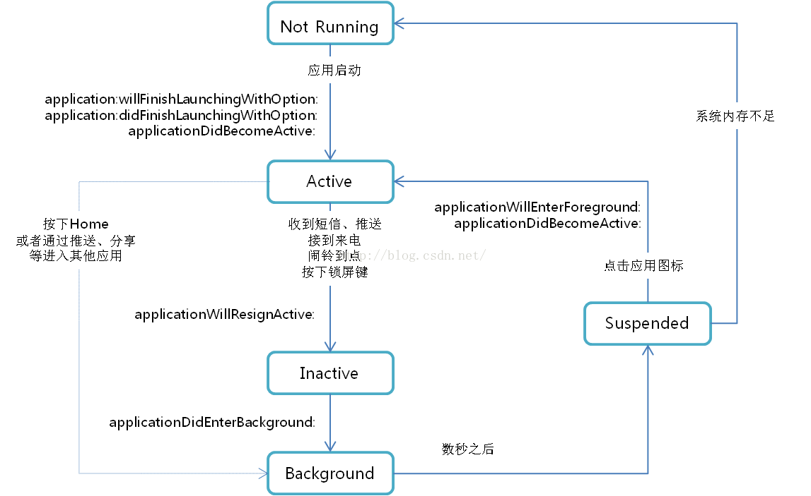

## 应用程序状态

| 状态        | 描述                                                         | 注意事项                           |
| ----------- | ------------------------------------------------------------ | ---------------------------------- |
| Not Running | 未运行，程序没有启动                                         |                                    |
| Inactive    | 未激活，程序在前台运行，但是没有接收到事件，在没有事件处理情况下程序会停留在这个状态 | 用户打开了应用，让后将手机放到一边 |
| Active      | 激活，程序在前台运行而且接收到了事件。这也是前台的一个正常的模式 |                                    |
| Background  | 后台，程序在后台而且能执行代码，大多数程序进入这个状态后会在在这个状态上停留一会。时间到之后会进入挂起状态(Suspended)。有的程序经过特殊的请求后可以长期处于Backgroud状态 |                                    |
| Suspended   | 挂起，程序在后台不能执行代码。系统会自动把程序变成这个状态而且不会发出通知。当挂起时，程序还是停留在内存中的，当系统内存低时，系统就把挂起的程序清除掉，为前台程序提供更多的内存。 |                                    |





图片来源：https://blog.csdn.net/E20914053/article/details/49852421


注意`applicationDidBecomeActive:` 和 `applicationWillEnterForeground:`的区别

应用从 `Not Running` 到 `Active` 状态，`applicationWillEnterForeground:`并没有被调用


### 中断处理

电话呼入，双击home等会中断当前应用，变成inactive

### Background

如果没有其他的处理，应用进入 Background 状态后只有短短几秒钟时间程序就会进入 Suspended 状态。

```
- (void)applicationDidEnterBackground:(UIApplication *)application {
    // 申请后台运行时间 iOS7 之后 是180s
    self.taskId = [[UIApplication sharedApplication] beginBackgroundTaskWithName:@"ApplicationTest" expirationHandler:^{
        [[UIApplication sharedApplication] endBackgroundTask:self.backgroundTask];
        self.backgroundTask = UIBackgroundTaskInvalid;
    }];  
}
```


`beginBackgroundTaskWithName:` 和 `endBackgroundTask:`必须成对调用，否则时间一到应用会被 kill。

`beginBackgroundTaskWithName:` 和 `endBackgroundTask:`必须成对调用，否则时间一到应用会被 kill。

`beginBackgroundTaskWithName:` 和 `endBackgroundTask:`必须成对调用，否则时间一到应用会被 kill。


如果时间没有用完 `[UIApplication sharedApplication].backgroundTimeRemaining`,应用又回到了前台，主动调用 `endBackgroundTask:`

````
- (void)applicationWillEnterForeground:(UIApplication *)application {
    if (self.taskId != UIBackgroundTaskInvalid) {
        [[UIApplication sharedApplication] endBackgroundTask:self.backgroundTask];
         self.taskId = UIBackgroundTaskInvalid;
    }
}
````

后台任务执行完成，需要主动调用 `endBackgroundTask:`

```
dispatch_group_t bgGroup = dispatch_group_create();

dispatch_group_enter(bgGroup);
[self saveDataToFileWithCompletion:^{
    dispatch_group_leave(bgGroup);
}];

dispatch_group_enter(bgGroup);
[self uploadDataWithCompletion:^{
    dispatch_group_leave(bgGroup);
}];

dispatch_group_notify(bgGroup, dispatch_get_main_queue(), ^{
    MPLogInfo(@"%@ ending background cleanup task %lu", self, (unsigned long)self.taskId);
    if (self.taskId != UIBackgroundTaskInvalid) {
    		[[UIApplication sharedApplication] endBackgroundTask:self.backgroundTask];
        self.taskId = UIBackgroundTaskInvalid;
    }
});
```

`beginBackgroundTaskWithName:`嵌套调用是没有用的，可能是因为数据存在 `[UIApplication sharedApplication].backgroundTimeRemaining`里面，在 `endBackgroundTask:`被调用前，这个时间没有还原。

有时间再去验证这个问题。


> 应用退到后台时，使用 applicationIconBadgeNumber 来判断代码还在不在执行是个不错的选择

```
#import <UserNotifications/UserNotifications.h>

- (BOOL)application:(UIApplication *)application didFinishLaunchingWithOptions:(NSDictionary *)launchOptions {
    SJLogInfo(@"didFinishLaunchingWithOptions");
    
    //注册推送
     UNUserNotificationCenter *center = [UNUserNotificationCenter currentNotificationCenter];
     [center requestAuthorizationWithOptions:(UNAuthorizationOptionBadge | UNAuthorizationOptionSound | UNAuthorizationOptionAlert) completionHandler:^(BOOL granted, NSError * _Nullable error) {
         if (!error) {
             NSLog(@"request authorization succeeded!");
         }
     }];
    
    [[FLEXManager sharedManager] showExplorer];
    return YES;
}

- (void)applicationDidEnterBackground:(UIApplication *)application {
    SJLogInfo(@"applicationDidEnterBackground");
    [self startBackTask];
    [self startBadgeNumberCount];
}

- (void)startBadgeNumberCount {
    [UIApplication sharedApplication].applicationIconBadgeNumber = 0;
    
    _badgeTimer = dispatch_source_create(DISPATCH_SOURCE_TYPE_TIMER, 0, 0, dispatch_get_main_queue());
    dispatch_source_set_timer(_badgeTimer, DISPATCH_TIME_NOW, 1 * NSEC_PER_SEC, 1 * NSEC_PER_SEC);
    dispatch_source_set_event_handler(_badgeTimer, ^{
        [UIApplication sharedApplication].applicationIconBadgeNumber ++;
    });
    dispatch_resume(_badgeTimer);
}
```


